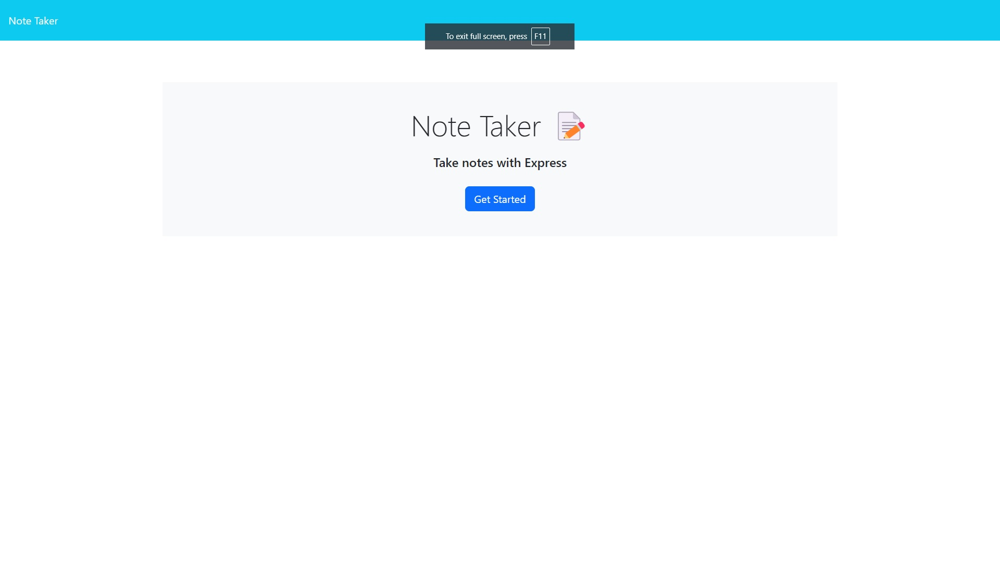

# Note-Taker

# Table of Contents: 
- [User Story](#user-story)
- [Description](#description)
- [Challenges](#challenges)
- [Screenshot](#screenshot-of-note-taker)

# User Story:
AS A small business owner
I WANT to be able to write and save notes
SO THAT I can organize my thoughts and keep track of tasks I need to complete

# Description:
The goal of this project was to create a note taking application.  This application would allow small business owners to be able to take notes on an application, and be able to save those notes and add to it. Once the user adds notes, the save button should appear, and the user should be able to successfully save.  

# Challenges:
There were many challenges that i faced while creating this project.  One of the challenges was figuring out how to allow the user to be able to create and save Notes.  

# Screenshot of Note Taker:
